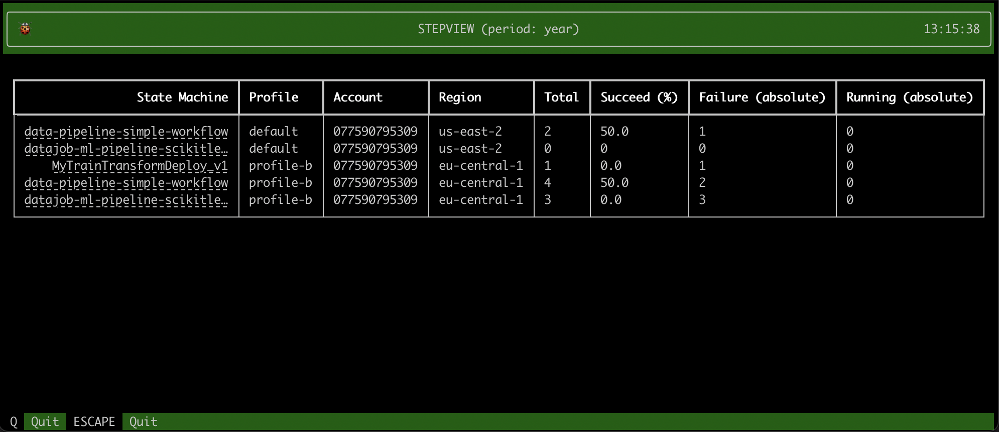

# StepView

Follow up on all your AWS Stepfunctions over different accounts, over different regions, right from the terminal.



- See the total executions of your statemachines.
- See the % Succeeded executions.
- See the # of Running executions.
- See the # of Failed/Aborted/TimedOut/Throttled executions.
- Click the statemachine name to navigate to the AWS console.


## Installation

    pip install stepview

## Usage

    $ stepview --help
        Usage: stepview [OPTIONS]
        
        Options:
          --profile TEXT        Specify the aws profile you want to use as a comma
                                seperated string. For example '--profile
                                profile1,profile2,profile3,...'  [default: default]

          --period TEXT         Specify the time period for which you wish to look
                                back. You can choose from the values: minute, hour,
                                today, day, week, month, year  [default: day]

          --tags TEXT           Specify the tags you want to filter your stepfunctions
                                statemachine. Provide your tags as comma seperated key
                                words: --tags foo=bar,baz=qux

          --verbose             Use --verbose to set verbose logging.


## Example

- [Setup an AWS named profile](https://docs.aws.amazon.com/cli/latest/userguide/cli-configure-profiles.html#cli-configure-profiles-create).
- Choose a time period: `minute`, `hour`, `today`, `day`, `week`, `month`, `year`.

```
stepview --profile foo,bar --period year
```


## Suggestions

- Any suggestions can be shared by creating an [issue](https://github.com/vincentclaes/stepview/issues)
- Or you can reach out to me via [twitter](https://twitter.com/VincentClaes1) or [linkedin](https://www.linkedin.com/in/vincent-claes-0b346337/)
