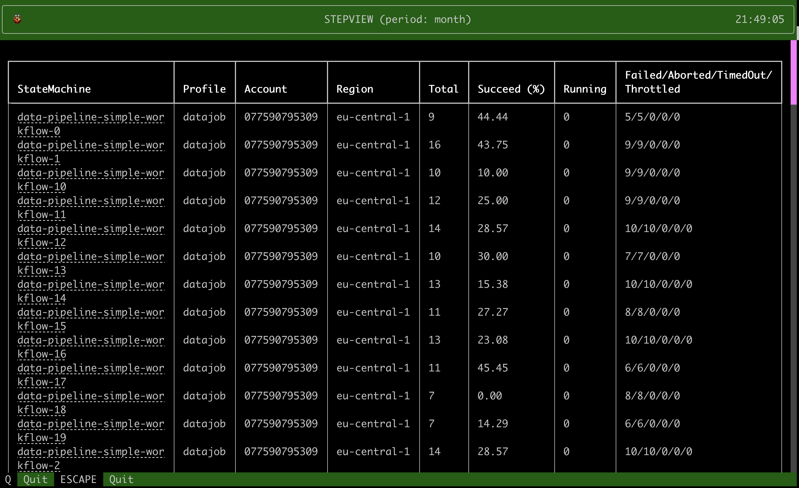

# StepView

Visualize a summary of all your stepfunctions in the terminal for
multiple AWS profiles.

## Installation

    pip install stepview

## Usage

    stepview --help

        Usage: stepview [OPTIONS]

        Options:
          --profile TEXT                  specify the aws profile you want to use as a
                                          comma seperated string. For example '--
                                          profile profile1,profile2,profile3,...'
                                          [required]
          --period TEXT                   specify the time period for which you wish
                                          to look back. You can choose from the
                                          values: "minute, hour, today, day, week,
                                          month, year"   [default: day]
          --help                          Show this message and exit.

## Example

Specify an AWS named profile and a time period you wish to use.
Be sure to [setup an AWS profile](https://docs.aws.amazon.com/cli/latest/userguide/cli-configure-profiles.html#cli-configure-profiles-create)
if you do not know how to do it.
The Time period from which you can choose from
are `minute`, `hour`, `today`, `day`, `week`, `month`, `year`

    stepview --profile default,some-profile --period year

## Suggestions

Any suggestions can be shared by creating an [issue](https://github.com/vincentclaes/stepview/issues)
Or you can reach out to me via [twitter](https://twitter.com/VincentClaes1) or [linkedin](https://www.linkedin.com/in/vincent-claes-0b346337/)
